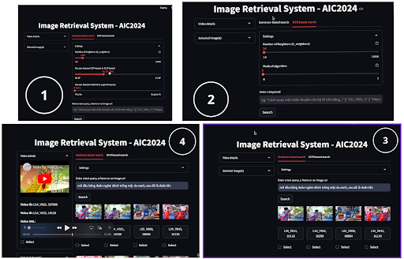
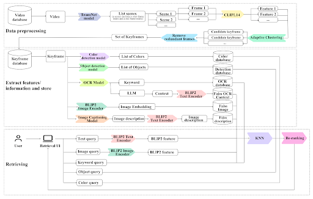

<p align="center">
  
</p>

<h1 align="center"> ⚡️ evento </h1>


<p align="center">
  <em>Joining forces with innovators and AI enthusiasts, this project is a dynamic collaboration aimed at crafting a cutting-edge event-retrieval system, proudly participating in the Ho Chi Minh AI Challenge 2024.</em>
</p>


  
  
  
<!-- TABLE OF CONTENTS -->
<details>
  <summary>Table of Contents</summary>

- [📍 Overview](#-overview)
- [🎯 Features](#-feature)
- [🤖 Tech Stack](#-technologies-used)
- [🚀 Usage](#-usage)
- [📋 API](#-api)
- [🎬 Demo](#-demo)
- [👣 Workflow](#-workflow)
- [📐 App Structure](#-app-structure)
- [🧑‍💻 Contributors](#-contributors)
</details>

## 📍 Overview
Welcome to `⚡️ evento`, an ambitious collaborative project aimed at revolutionizing event retrieval through the innovative use of visual data. Our team, **AIO_TOP10**, is honored to participate in the prestigious Ho Chi Minh AI Challenge 2024, where we strive to showcase our expertise in artificial intelligence. We are committed to developing a cutting-edge, robust, and efficient event-retrieval system, leveraging the immense potential of AI to enhance information retrieval processes.


More details about the challenge refers to this [link.](https://aichallenge.hochiminhcity.gov.vn/)


## 🎯 Features

- [x] Multimodal search.
- [x] Synthetic data with a Multimodal Model. 
- [ ] Share similarity search.
 
_Note:_ We are happy to share our [trip](https://trello.com/invite/b/66c4acf531cdf8fd5c8f167e/ATTI60ab09c08943d3ba5220d47918aab2229CBAC9CF/aiotop10-evento) while developing this app. 


## 🤖 Tech Stack

### Server building

- Back-end: FastAPI. 
- Front-end: Streamlit.

### Core technology

- Keyframe-extraction: TransNetV2 + Adaptive clustering.
- LLM: Gemini. 
- Embedding: CLIP, BLIP2.


## 🚀 Usage

1. **Clone the repository**
```
git clone https://github.com/MinLee0210/evento.git
cd /evento
```

2. **Setup Environment**

**Download dataset from Kaggle**

We store our dataset on Kaggle. Please, download it from [here](https://www.kaggle.com/datasets/pyetsvu/aic2024-extracted-data) and compress it in `db` directory, `/backend/db`.
Additionally, we have 2 other appoaches to download. You can read the detail from [here](backend/db/README.md).

_Note:_ Currently, we do not offer an automated solution for transferring our local dataset to a database. However, we highly recommend considering MySQL for efficient data reading, MongoDB for seamless data writing, and Redis for caching high-similarity queries, a feature we refer to as 'share search'. For more insights into our share search mechanism, please refer to our comprehensive documentation (docs).

**Set API's key in backend directory**

We use Gemini's API for extracting keywords and refining queries. As a result, setting Gemini's API key is essential to run the app. We also provide a `env.template` as an example in the `backend`.


3. **Run the application**

**Run the backend**

```
# /evento

cd /backend
bash start_be.sh 
```
In case you can not run `bash`: 

1. Install requirements with `pip install -r requirements.txt`
2. Move to the `/app` and run `uvicorn main:app --host=0.0.0.0 --port=8000 --reload`.

 
Run the frontend

```
# /evento

cd /frontend
bash start_fe.sh 
```

In case you can not run `bash`: 

1. Install requirements with `pip install -r requirements.txt`
2. Run `streamilit run app.py`.

## 📋 API

|Method| Type | Description | 
| - | - | - |
|`/`| `GET` |  Get a random quote. Just for checking basic connection between frontend and backend. | 
| `/search` | `POST` | Search by text. |
| `/search/ocr` | `POST` | Search by fuzzy matching between extracted keywords and OCR-based extraced data.  |
| `/search/image/{image_idx}` | `GET` | Get image by `image_idx`. |
| `/search/video/{vid_idx}` | `GET` | Get video metadata by `vid_idx`. |

_Note:_ Detail about how to get response after running the app successfully is in [notebook](./docs/notebooks/dev_search_text_api.ipynb)


## 🎬 Demo

- **Galleries**


- **Videos**: [here](https://youtu.be/ukiFaszIT1E)


## 👣 Workflow



## 📐 App Structure
```
.
├── backend
│   ├── app
│   │   ├── main.py            # create_app(): FastAPI app + lifespan
│   │   ├── core               # Settings, logger
│   │   ├── components         # Embedder (CLIP/BLIP), Translator, QueryRefiner, OcrMatcher
│   │   ├── services           # SearchService, KeyframeCatalog, VectorStore
│   │   ├── schema             # Request/response models
│   │   └── routes             # HTTP endpoints
│   ├── db                     # Dataset (features, media-info, s_optimized_keyframes, ...)
│   ├── experimental           # Offline tooling (keyframe extraction, recommender, captioning)
│   └── tests                  # pytest suite, runs without models or dataset
├── docs
├── frontend
│   ├── app.py                 # Streamlit entrypoint
│   ├── client.py              # BackendClient
│   ├── search_page.py         # SearchPage + SearchState
│   └── views
└── scripts
```

Run the backend tests with `cd backend && pytest tests`.


## 🧑‍💻 Collaborators

A big thank you to the following amazing individuals for their valuable contributions to this project:

* [Vũ Hoàng Phát](https://github.com/paultonsdee) - Lead Project Manager & AI Solutions Developer
  * Primarily responsible for researching and implementing AI solutions
  * Analyzed and processed data

* [Lê Đức Minh](https://github.com/MinLee0210) - Backend Developer & AI Researcher
  * Deployed the backend
  * Conducted research to propose ideas for new features and improvements

* [Trần Nguyễn Vân Anh](https://www.facebook.com/vananh.trannguyen.54584) - AI Researcher & Technical Writer
  * Contributed to AI research and technical documentation

* [Phạm Thị Ngọc Huyền](https://www.facebook.com/ngochuyenpham.99) - AI Researcher, Technical Writer & UI/UX Designer
  * Focused on AI research, writing technical content, and designing user-friendly interfaces

* [Phạm Nguyễn Quốc Huy](https://github.com/kidneyflowerSE) - Frontend Developer
  * Developed and optimized the frontend

* [Nguyễn Hải Đăng]() - Technical Writer Mentor
  * Mentored and guided the team in creating high-quality technical documentation

